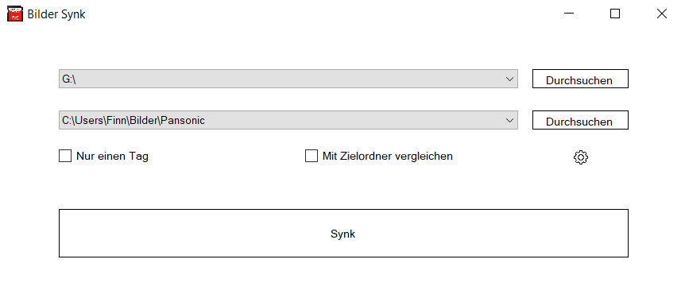

# BilderSync
Image sync programs for multiple camera types

Since I always had to use a different program for each camera, I created this project to simplify the process.

You can sync images with the default settings from:
- Panasonic
- Canon
- GoPro
- Other systems were not testet, but they can work too.

But if you change the settings you can synchronize **any kind** of camera.

There is no guarantee, that the formats on the SD-Cards are always the same, but BilderSync is as brand independent as possible.

## How this works
You select the path of the SD-Card and the target directory.
Default BilderSync checks the images with previous synchronizations and copies only the new images in subdirectories for each day.
But you also can copy only one specific day or compare the two directories completely and copy all different files (This process can need some time).

## Language
Currently only available in german.

## Screenshot

